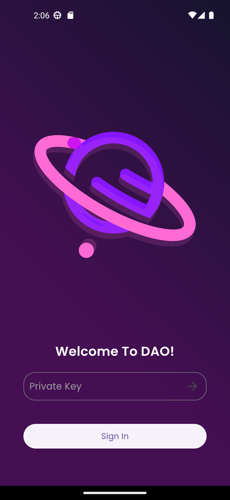
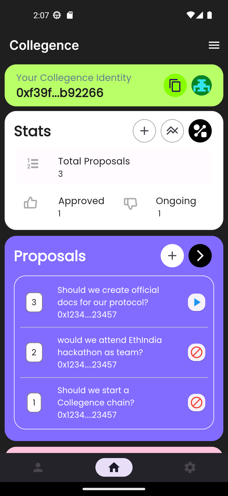
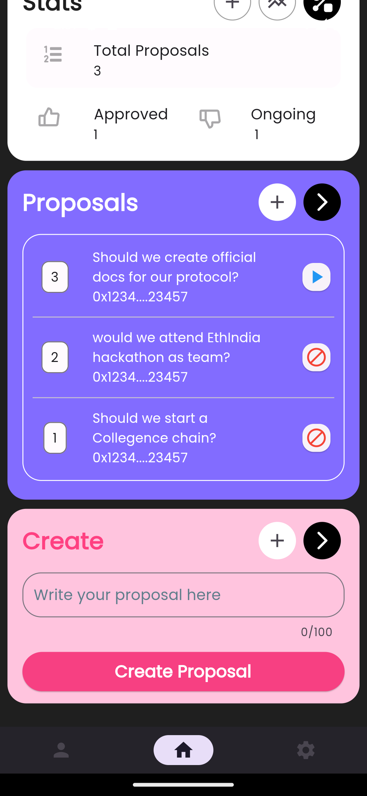
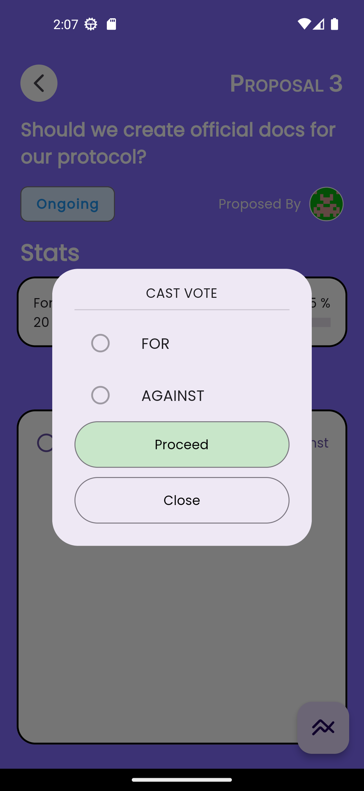

<p align="center">

<h2 align="center"> DAO </h2>

<p align="center">
Collegence is a decentralized autonomous organisation (DAO) <br>that has no central governing body is collectively-owned, blockchain<br>-governed oraganisation working towards a shared mission.
</p>

<br>

---
<br>
<p align="center">
 &nbsp;
&nbsp;
&nbsp;
&nbsp;
</p>
<br>  

---

Blockchain Network: **Polygon Mumbai**  
 Contract Address: [0x08e081fc2Ff1dAa884c1107C13C59037268b5AE4](https://mumbai.polygonscan.com/address/0x08e081fc2Ff1dAa884c1107C13C59037268b5AE4#code)  
 DApp Link: [Download now]("#")

## TECHSTACK

|                 | `SMART CONTRACT` | `FRONTEND`               |
| --------------- | ---------------- | ------------------------ |
| **Language**    | Solidity, JavaScript        | Dart              |
| **Framework**   | Hardhat          | Flutter |
| **Library**     | Ethers.js           | Web3Dart |
| **Deployed to** | Polygon Mumbai   | GitHub |

Dependencies :

- **Node.JS**
- **Metamask**
- **Flutter SDK**

You need to have metamask installed in your browser and connect to Polygon Mumbai testnet. You also need to have some testnet Polygon Mumbaia and Member NFT Tokens tokens for voting.

---

## GETTING STARTED

```bash
git clone http://www.github.com/subrotokumar/collegence-dao.git
cd collegence-dao
yarn
yarn dev
```
